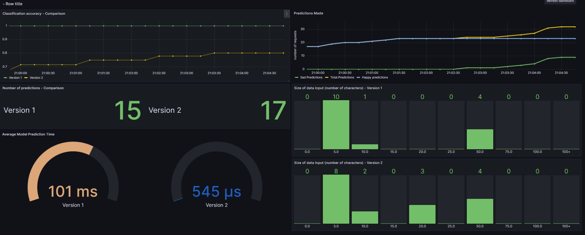

# Operation
This project contains a sentiment analysis application that classifies restaurant reviews to be positive or negative. 

The web application can be found here: http://remla23-team09.com/.

## Code Overview
- The [Model-training](https://github.com/remla23-team09/model-training/tree/main) repository trains the model and preprocesses the data. Check dvc.yaml to see the ML pipeline.
- The [Model-service](https://github.com/remla23-team09/model-service) repository embeds the ML model in a Flask webservice. Check /src/interface.py.
- The [Lib](https://github.com/remla23-team09/lib) repository contains a simple version-aware library. Check VersionUtil.py.
- The [App](https://github.com/remla23-team09/app) repository contains a simple Flask frontend application. Check app.py. 

## Run with Docker (A1)
- Make sure to have Docker and Docker compose installed.
- To run the application locally run `docker-compose up`. This starts the `app` and the `model-service` containers. 
- Open `localhost:8080` to classify restaurant reviews. 

## Run with helm charts (A2)
- If you desire to deploy applications as helm charts navigate to **app** and **model-service** repositories where you run the respective commands:
    - `helm install <app-name> .\helm-chart\app-chart\`
    - `helm install <model-service-name> .\helm-chart\model-service-chart\`

The helm charts refer to the latest available images from the public repositories.

## Monitoring with ServiceMonitor (A2)
In order to start Prometheus and Grafana run the following commands:

- `helm repo add prometheus-community https://prometheus-community.github.io/helm-charts`
- `helm repo update`
- `kubectl create namespace monitoring`
- `helm install kube-prometheus prometheus-community/kube-prometheus-stack --namespace monitoring`
- `kubectl port-forward -n monitoring svc/kube-prometheus-kube-prome-prometheus 9090:9090`
- `kubectl port-forward -n monitoring svc/kube-prometheus-grafana 80:80`

## Continuous Experimentation (A3)

### Istio
First, install Istio from https://github.com/istio/istio/releases/tag/1.17.2. 

Run the following commands:
1. `minikube start`
2. `istioctl install`
3. `kubectl label namespace default istio-injection=enabled`

Inside the folder with your istio installation run the following commands:  
4. `kubectl apply -f istio-1.17.2/samples/addons/prometheus.yaml`    
5. `kubectl apply -f istio-1.17.2/samples/addons/jaeger.yaml`    
6. `kubectl apply -f istio-1.17.2/samples/addons/kiali.yaml`   
7. `kubectl apply -f istio-1.17.2/samples/addons/grafana.yaml`  

8. `helm install app .\app-chart\` (inside the app repo)
9. `helm install model-service .\model-service-chart\` (inside the model-service repo)
10. `istioctl analyze` (check that everything is ok)
11. `kubectl apply -f istio.yml` (inside the operations repo)
12. `minikube tunnel`

Open `localhost:80` to reach the app.

To open Kiali, promotheus and grafana:
- istioctl dashboard kiali
- istioctl dashboard prometheus
- istioctl dashboard grafana

### Kiali
In Kiali you can observe the Istio service mesh. Here is a screenshot from Kiali, visualizing the mesh traffic:

### Grafana

To open the Grafana dashboard, follow these instructions:
1. Download the JSON file in the `Grafana` folder.
3. Click Dashboards in the left-side menu.
4. Click New and select Import in the dropdown menu.
4. Upload the dashboard JSON file.

You should see the following dashboard:

## Terraform deployment

### Experiment

In our project, we have deployed two different versions of the app service. We have also implemented two different version of the model-service service. The app v1 is connected to model-service v1, and app v2 is connected to model-service v2. 50% of the requests are redirected to app v1 and 50% to app v2. 

The plan is to make two different ML models, and that the two different app services are using different ML models to classify the restaurant reviews. However, for now, the two versions are the same. 

The hypothesis is therefore that the metrics should be similar for both of the versions. Some of the metrics we measure are the number of predictions, time taken for prediction, length of input. These metrics can be seen in the screenshot of the Grafana dashboard above. 

When having the two different ML models, we will also add the classification accuracy for the ML models in order to be able to decide which ML model is the best. We will also continue to measure the time taken to make a prediction, in order to see which model is the most resource heavy.

### Rate limiting

Rate limiting has been implemented using Envoyfilter. We have chosen to limit app v1, because app v1 is the new version of the app service. Since that version will have a more resource heavy ML model, we want to limit the usage of that version. For now, users will be temporarily blocked if they send more than 5 requests per minute.

